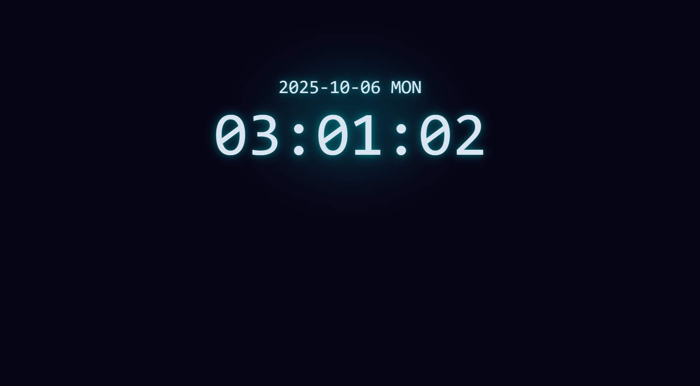

# Clock

A simple and elegant clock web application built using HTML, CSS, and JavaScript.

## Features

- **Analog & Digital Display:** View the current time in both analog and digital formats.
- **Responsive Design:** Works smoothly across devices and screen sizes.
- **Custom Styling:** Stylish clock face and hands with modern CSS.
- **Live Updates:** Time updates in real-time without needing to refresh the page.

## Screenshot

## Technologies Used

- **CSS**
- **JavaScript**
- **HTML** 

## Getting Started

Open the app directly in your browser:  
[https://achrefmaarfi.github.io/Clock](https://achrefmaarfi.github.io/Clock)

## Usage

Just visit the link above in any modern browser. The clock will display your current local time and update automatically.

## Customization

- You can customize the clock’s appearance by editing the CSS in the project.
- To modify functionality or add new features, update the JavaScript files.

## Contribution

Feel free to fork this repo and submit pull requests for new features, bug fixes, or improvements!

## License

This project is open source and available under the [MIT License](LICENSE).

## Author

Achref Maarfi — [GitHub](https://github.com/AchrefMaarfi)
